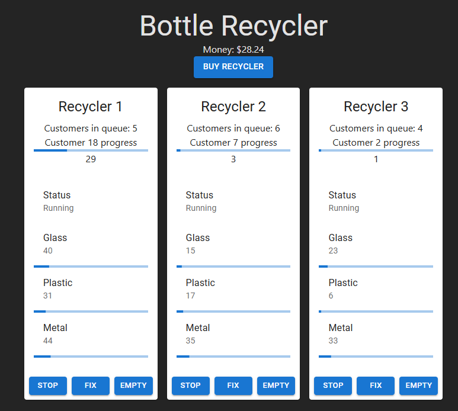

# Bottle Recycler

Trying to create a larger application, using React and the tools I like to try out.

- Basic React
- Playwright
- Material UI
- CI/CD github actions

## Components

Manager - Can create recyclers.

Recycler - Machine that accepts 3 different types of bottles to be recycled. It can also display the total amount of each type of bottle it has accepted so far, but when it gets full it need to be emptied.

